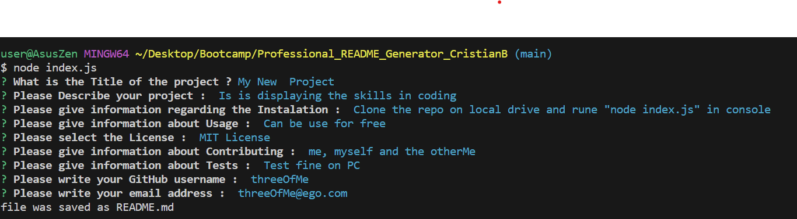
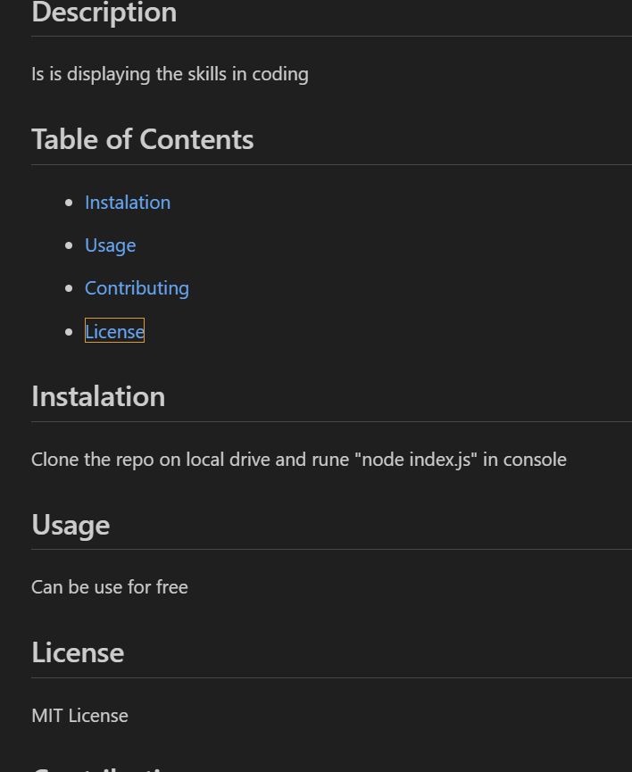

# Professional_README_Generator_CristianB


Professional README Generator - part of Bootcamp challenge


## Description

This Project was created for bootcamp challenge.

It tests the knowledge gained in NodeJS, JavaScript and JQuery during the last weeks, especially the implementation of NodeJS. It takes the user input in the terminal using nodejs and "inquirer" NPM, then it use the answers to create a file and generate the content in the format of a README.md file (located in the ```readme_generate``` folder).

This is how it looks in the terminal:
  

This is how the generated document looks :




## Installation

The repository is on the GitHub repositories public domain ...git and a demo videofile can be found at .../
The repository can be cloned on local disk and then the program can be started by typing ```node index.js``` in terminal


## Usage

The code is free to be used according to the licence condition (please see the licence file from the GitHub repository)


## Credits


- Bootcamp EDX ( a big cheers for bootcamp teachers! ) provided the needed **materials**, the most wanted **inspiration** and the difficult to obtain **motivation**  

  
- JQuery

        https://cdnjs.com/libraries/jquery/3.2.1


- Node.js v20.11.1.

         https://nodejs.org/en/download/

- Inquirer.js v8.0.0

         https://www.npmjs.com/package/inquirer/v/8.0.0#documentation
        

- Xpert Learning Assistant - the Bootcamp Course AI, used for helping with some of the javascript syntax
 
         https://bootcampspot.instructure.com/courses


- Markdown Guide used for styling the readme.md

         https://www.markdownguide.org/basic-syntax/


## License

MIT license


